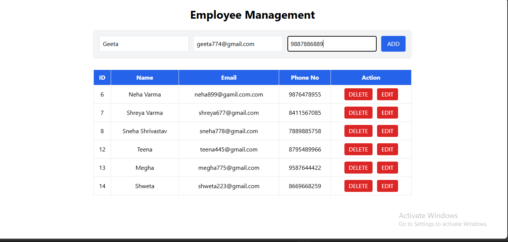
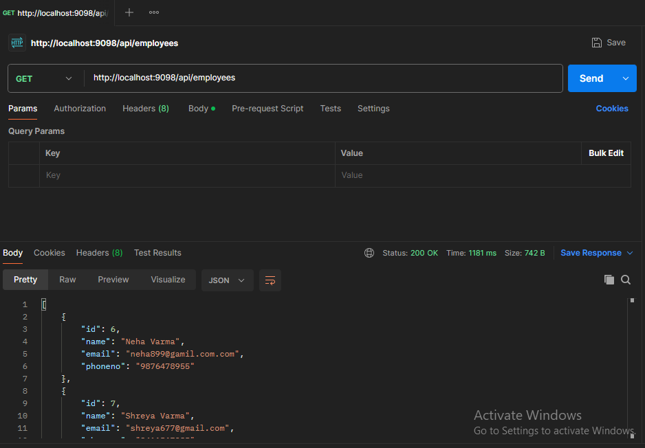
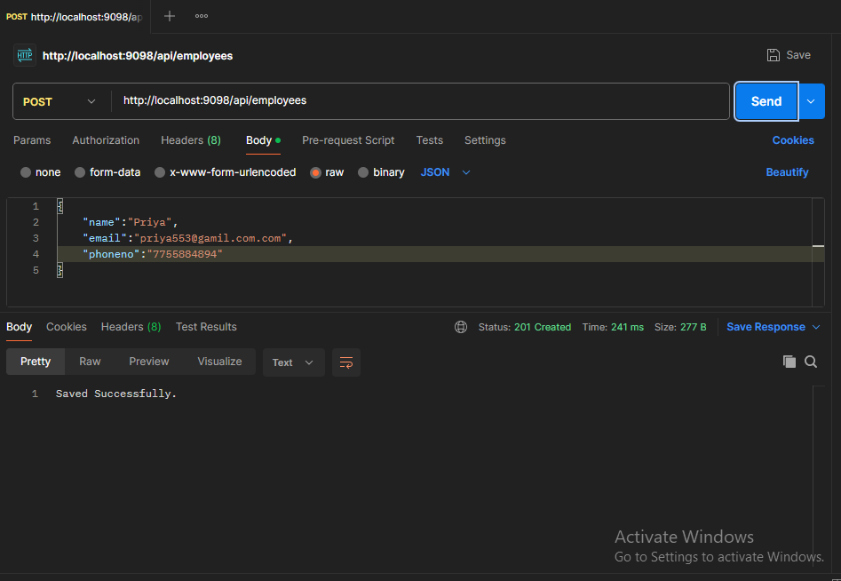

# 🧑‍💼 Employee Management System (Spring Boot)

A simple **Employee Management System** built using **Spring Boot**, **Spring Data JPA**, and **MySQL**.  
This project provides REST APIs for performing CRUD (Create, Read, Update, Delete) operations on Employee data.

---

## 🚀 Features

- Add a new employee  
- View all employees  
- Update existing employee details  
- Delete an employee  
- Cross-Origin support for React frontend (`http://localhost:3000`)

---
## 🖼️ Screenshots

### 1️⃣ Frontend - Employee Management Dashboard


### 2️⃣ Backend - API Testing (Spring Boot)

#### ➤ GET - Fetch All Employees


#### ➤ POST - Add New Employee


---

## 🧰 Tech Stack

| Layer | Technology |
|--------|-------------|
| Backend | Spring Boot (Java) |
| Database | MySQL |
| ORM | Spring Data JPA / Hibernate |
| Build Tool | Maven |
| Frontend  | React.js |
| IDE  | VS Code |

---

## 🧠 Project Structure

emp-project/
├── src/
│ ├── main/
│ │ ├── java/com/example/emp_project/
│ │ │ ├── controller/EmpController.java
│ │ │ ├── entity/Employee.java
│ │ │ ├── repository/EmployeeRepository.java
│ │ │ ├── service/EmployeeService.java
│ │ │ └── service/EmployeeServiceImpl.java
│ │ └── resources/
│ │     └── application.properties
│ └── test/
├── pom.xml
└── README.md

---

## ⚙️ API Endpoints

| Method | Endpoint | Description |
|--------|-----------|-------------|
| **GET** | `/api/employees` | Get all employees |
| **POST** | `/api/employees` | Create new employee |
| **PUT** | `/api/employees/{id}` | Update employee by ID |
| **DELETE** | `/api/employees/{id}` | Delete employee by ID |

---

## ⚡ Running the Application

### 🧩 1️⃣ Setup MySQL
Create a database named `employee_db` (or your preferred name).

---

### 🧩 2️⃣ Configure `application.properties`
```properties
spring.datasource.url=jdbc:mysql://localhost:3306/employee_db
spring.datasource.username=root
spring.datasource.password=your_password
spring.jpa.hibernate.ddl-auto=update
spring.jpa.show-sql=true ```

---


🧩 3️⃣ Run the Application

# Run the Spring Boot application
# Run from your IDE the main class EmpProjectApplication.java

---


The application will run at: http://localhost:9098


